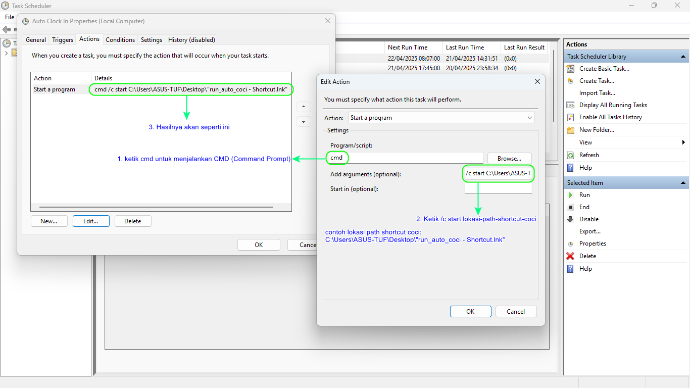

# 🕒 Auto Clock-In / Clock-Out (Auto COCI)

Otomatisasi absensi PeoplesHR via browser Microsoft Edge.

---

## 🧰 Tools yang Dibutuhkan

1. **Microsoft Edge** – sebagai browser utama.
2. **WebDriver Microsoft Edge** – untuk mengotomatisasi browser.
3. **Python** – untuk menjalankan script automation.

---

## 🚀 Cara Menggunakan

1. Clone repo ini pake git clone atau bisa langsung download melalui fitur Release (coba lihat di sebelah kanan)
2. [TIDAK WAJIB] Klik kanan pada file .zip lalu pilih Properties dan centang Unblock
3. Extract file .zip
4. **Pindahkan folder repo ke `C:\`**  
   → Supaya kamu cukup isi username dan password saja (tidak perlu isi path Python script).
5. **Rename folder menjadi `coci`**
6. [TIDAK WAJIB] Buka folder repo tersebut, lalu **buat shortcut file `run_auto_coci.bat`** ke lokasi mana pun (misalnya: Desktop).  
   → ⚠️ *Ingat*, **buat shortcut** ya, jangan di-*copy*!
7. Klik dua kali file shortcut `run_auto_coci.bat`.
8. Aplikasi akan menyiapkan semua yang dibutuhkan seperti:
   - Instalasi Python (jika belum terinstall).
   - Package Python yg dibutuhkan (jika belum terinstall).
   - Driver Microsoft Edge (jika belum terinstall), berdasarkan versi Microsoft Edge yang sudah terinstall.
9. Masukkan username dan password akun PeoplesHR.
10. Masukkan path direktori `auto_coci.py` (misal: `C:\Users\ASUS-ROG\Desktop\coci`)  
   → ⏭️*Kalau kamu sudah simpan repo di `C:\`, bagian ini akan otomatis dilewati.*
11. Tunggu proses selesai. Aplikasi akan menutup otomatis.

---

## 📝 Catatan
- Menggunakan browser Microsoft Edge.
- Aplikasi akan otomatis mengunduh dan menginstall webdriver dari Mirosoft Edge jika tidak ditemukan.
- Jika ingin memindahkan `run_auto_coci.bat`, **wajib buat shortcut**, bukan di-*copy* ke tempat lain.
- Shortcut bisa kamu taruh di mana saja.
- Bisa dijalankan secara otomatis menggunakan scheduler Windows.
- Atur Scheduler Windows dengan menjalankan shortcut CoCi menggunakan CMD dengan perintah `/c start lokasi-shortcut-coci`.
   - contoh: `/c start c:\Users\ASUS-TUF\Desktop\"run_auto_coci - Shortcut.lnk"`
      - Gunakan ekstensi `.lnk` untuk file shortcut.  
      - Gunakan tanda petik apabila nama file shortcut memiliki spasi.
      - Untuk mandapatkan path shortcut, cukup klik 1x pada file shortcut lalu tekan `CTRL + Shift + C`.
   - 
- Kalo mau ubah username dan pass peopleshr bisa di file .env (sementara)
- Udah ada fitur auto-install (biar makin praktis):
   - Python
   - Package Python yang dibutuhkan
   - WebDriver Microsoft Edge
- Kalo hasil dari download zip gabisa dibuka, kamu bisa jalankan `convert_to_crlf.ps1` di dalam folder `script` menggunakan `PowerShell`. Caranya tinggal klik kanan lalu pilih `open in powershell`.

---

## ❓ FAQ
### 1. Kenapa selalu muncul instalasi `python-dotenv` meskipun sudah diinstall sebelumnya?
Biasanya terjadi jika kamu menginstall Python lewat **Microsoft Store**.

#### Kenapa bisa begitu?
Karena Python dari Microsoft Store:
- Terisolasi di direktori khusus.
- Pip menginstall ke user site-packages (`--user` mode), bukan global.
- Beberapa alat Python (termasuk `__import__`) dan `PYTHONPATH` tidak sinkron dengan site-packages user.

#### Solusi?
Install Python dari website resminya: https://www.python.org/downloads/

### 2. Kenapa mengguunakan Microsoft Edge?
Microsoft Edge adalah browser yang menggantikan Internet Explorer[[1]](https://learn.microsoft.com/id-id/shows/it-ops-talk/microsoft-edge--internet-explorer-retirement-announcement). Sehingga ketika menggunakan sistem operasi Windows, maka secara otomatis Edge sudah terinstall[[2]](https://www.microsoft.com/en-us/edge/windows-edge?form=MA13FJ&cs=3477714609).

---

## 🔗 Referensi

- 📝 [1] [Microsoft Edge | Pengumuman Penghentian Internet Explorer](https://learn.microsoft.com/id-id/shows/it-ops-talk/microsoft-edge--internet-explorer-retirement-announcement)
- 🪟 [2] [Windows + Edge | Better Together](https://www.microsoft.com/en-us/edge/windows-edge?form=MA13FJ&cs=3477714609)
- 📥 [Download Python](https://www.python.org/downloads/)
- 🌐 [Download Microsoft Edge](https://www.microsoft.com/id-id/edge/download?form=MA13FJ)
- ⚙️ [Download Edge WebDriver](https://developer.microsoft.com/en-us/microsoft-edge/tools/webdriver/?form=MA13LH#installation)
- 📚 [Dokumentasi Edge WebDriver](https://learn.microsoft.com/en-us/microsoft-edge/webdriver-chromium/?tabs=c-sharp&form=MA13LH)